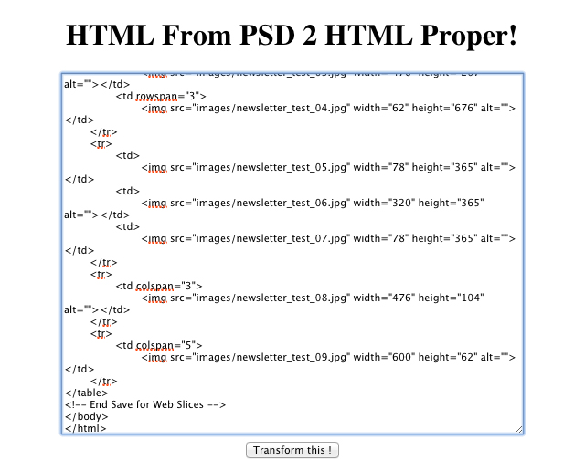

Dans une vie d&rsquo;intégrateur, généralement, il n&rsquo;y a pas que des dossiers de 20 ou 30 templates à intégrer avec passion, professionalisme, dévouement, logique et amour. Non. Il y a le darkside de l&rsquo;intégration, j&rsquo;ai nommé la Newsletter.
La newsletter, dans mon métier, intervient lorsqu&rsquo;il faut que j&rsquo;intègre un template d&rsquo;email dit transactionnel : à chaque fois qu&rsquo;un utilisateur d&rsquo;un de nos Magento s&rsquo;inscrit / change une information / passe une commande, il reçoit un mail avec ses informations. Et comme on est pas des chiens, on lui met un petit template, généralement très simple, avec le logo du site, la typo qui rappelle celle du site, et basta.
Comment ça se passe pour intégrer ce genre de template : 1) on demande / le graphiste sait qu&rsquo;il ne faut pas faire trop compliqué lors du PSD 2) il le fait 3) on chiale 4) il le retouche un peu 5) on chiale encore + 6) on a un psd qu&rsquo;on découpe <del datetime="2012-04-29T08:54:12+00:00">à la pute</del> sur Adobe Photoshop avec les slices 7) File -> Save for Web -> HTML & Images 8) ??? 9) Profit!

Oui mais voilà : on va pas se le cacher, les clients mails online (Gmail, Hotmail, Yahoo!) ou offline (Mail.app, Microsoft <del datetime="2012-04-29T08:54:12+00:00">vamourir</del> 2003 / 2007 / 2010) sont des tous des connards. TOUS. Dans le sens où ils interprètent l&rsquo;HTML un peu comme ils veulent.

De ce fait, what to do: donner une taille aux TD de la taille des img enfants, display:block; sur lesdites images (hack Gmail), border=0 pour éviter d&rsquo;avoir un trait bleu sur les liens des images. C&rsquo;est la base. Ensuite, un peu de skill en inté pour peaufiner ça et en avant Guingamp.

Et moi, vous avez pu le voir sur mon [premier outil avec les colonnes là][1], les tâches répétitives ont tendance à m&rsquo;ennuyer sec. De ce fait, allez, c&rsquo;est cadeau :

  

Pas de design, pas d&rsquo;autre fonctionnalité, on va au plus simple : l&rsquo;outil fait ce qu&rsquo;on lui demande et basta (j&rsquo;en profite pour en placer une pour monsieur mon DT).

Le tout se trouve encore une fois sur [Github][2]. Pour les plus frileux d&rsquo;entre vous, n&rsquo;hésitez pas à vous installer Git et à vous y mettre, voilà.

 [1]: http://blog.c-krylatov.com/2012/04/07/loutil-de-la-flemme-ultime-convertir-des-pixels-en-pourcentage/
 [2]: https://github.com/DaPo/PSD2PROPERHTML
