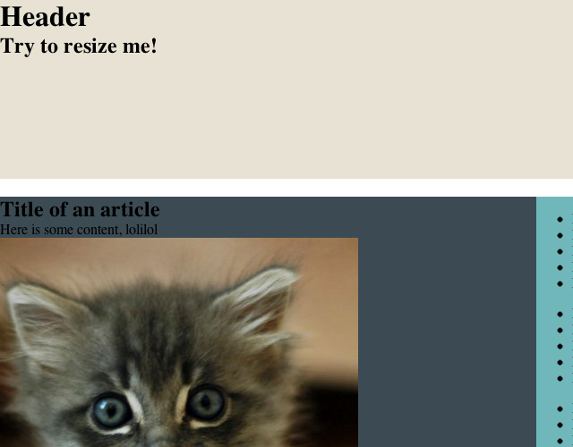

Les gars, va arriver un jour où un client va nous demander un Magento &laquo;&nbsp;compatible iPhone&nbsp;&raquo;. Ca nous pend au nez assez sévèrement. Même si je ne suis pas super fan du fait de pouvoir aller sur un site aussi gros que peut l&rsquo;être un Magento sur son mobile (les goûts et les couleurs, hein), je pense qu&rsquo;on va y avoir le droit. Du coup, j&rsquo;ai pris un peu d&rsquo;avance (nan, j&rsquo;déconne, énormément de retard que je rattrape (un peu ici), ça fait combien de temps qu&rsquo;on parle de responsive design, déjà ?), j&rsquo;me suis fais un petit layout des familles et j&rsquo;ai testé, histoire de faire briller mes petites pupilles, ce que sont les medias queries.

  

<!--more-->

Pour les plus barbus d&rsquo;entre vous, le code est disponible sur [Github][1] et pour les moins barbus, j&rsquo;ai upload les fichiers [juste ici][2].

xoxo

 [1]: https://github.com/DaPo/testResponsive
 [2]: http://blog.c-krylatov.com/wp-content/uploads/2012/05/testResponsive/
