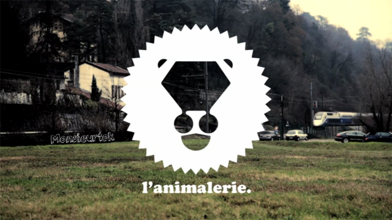

Il y a un peu plus de 3 ans, pas encore 4, j&rsquo;écrivais un article sur [un sujet qui me passionne][1] qui est le rap français. Sujet toujours autant passionnant chez moi, qui prend de l&rsquo;ampleur quand il ne se passe pas une seule journée sans que j&rsquo;écoute un morceau, un album ou des freestyles du même artiste.

  

<!--more-->

L&rsquo;Animalerie est un groupe de rappeurs lyonnais qui ont, selon moi, un talent fou, talent que nous ne retrouvons malheureusement pas dans la majorité du rap dont on entend le plus parler. Des beats de dingues, des lyrics très bien choisies, une caméra, du talent : il n&rsquo;en faut pas plus à ces rappeurs (Anton Serra, Lucio Bukowski, Kacem Wapalek, Nadir, Dico, et j&rsquo;en passe) pour exercer un talent digne des plus grands.

Au début, c&rsquo;était ça : des freestyles filmés à l&rsquo;arrache sur un beat composé par le beatmaker Oster Lapwass, des beats toujours justes qui semblent à chaque fois coller aux flows des artistes qui posent leurs 16 meuz&rsquo; dessus. Maintenant, ça tend à avoir une meilleur qualité de production visuelle mais le reste ne change pas, on en redemande.

         

Ensuite, les affinités semblent se faire, des débuts de clips commencent à arriver. Des clips très simples mais qui font le travail, on a pas besoin de plus, on est là pour écouter le beat et le flow, pas pour regarder des meufs qui sortent d&rsquo;on ne sait où se trémousser pour palier au manque cruel de talent de l&rsquo;artiste.

   

Et puis, des OVNI, des prods un peu bizarres, à l&rsquo;instar d&rsquo;un Anton Serra qui te lache un freethai avec des images de Thaïlande, ce morceau est fou, je le saigne encore et encore :

Ou encore Lucio Bukowski à qui on a donné, à 3 occasions, 50 mots, à lui d&rsquo;enchainer les mesures, le résultat est un régal.

     

Et j&rsquo;en place une pour Marie, qui apporte un peu de douceur dans ce rap, qui n&rsquo;en dénote rien car sa voix et son flow sont fabuleux.

Pour finir, les principaux liens du groupe : le [compte youtube principal du groupe][2] qui regroupe tous les morceaux, la [page facebook][3] de l&rsquo;Animalerie, le [soundcloud du beatmaker Oster Lapwass][4] et pour finir, le [site du groupe][5] pour les soutenir contre une bouchée de pain (par exemple, acheter les albums ou des tshirts comme j&rsquo;ai fait moi, mais la Poste n&rsquo;a pas été d&rsquo;accord avec ça, je chiale, je chiale).

 [1]: http://blog.dondapo.net/2009/12/04/moi-aussi-jaime-le-rap-francais/
 [2]: http://www.youtube.com/user/lapwass?feature=watch
 [3]: http://www.facebook.com/Lanimalerie
 [4]: http://soundcloud.com/oster-lapwass
 [5]: http://www.osterlapwass.fr/shop/1
