Sans plus d'introduction que nécessaire, voici la liste des podcasts que j'écoute. Aucun ordre de préférence si ce n'est alphabétique.

<!--more-->

## 2 Heures De Perdues

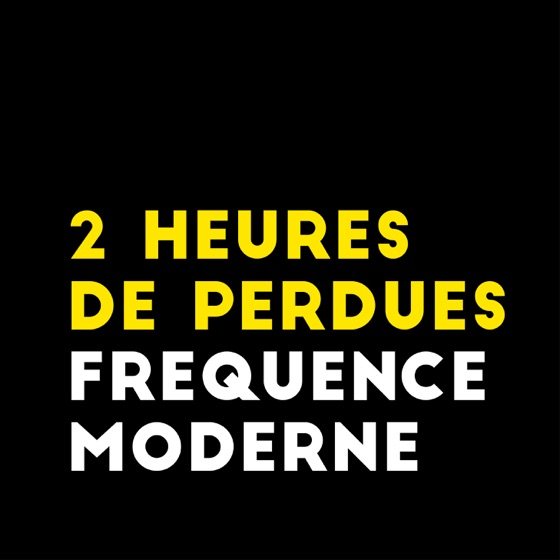

__Le pitch__ [Antoine](https://twitter.com/PMB_fm), [Julie](https://twitter.com/Julie_Anna_G), [Sarah](https://twitter.com/sarah2hdp), [Léa](https://twitter.com/Lea_G0), [Éva](https://twitter.com/evesaintlouis) se réunissent autour de micros pour parler d'un film et en font la critique. C'est autant de mauvaise foi que c'est drôle, toujours juste, des privates jokes qui se suivent, ils font tout pour qu'on soit avec eux, dans leur salon, à leur côté, et c'est très agréable.

__Mes kinks__ Le rire d'Antoine et de Julie, quand Antoine présente les personnes présentes en rallongeant les syllabes en début d'émission, les massives.

[Lien iTunes](https://itunes.apple.com/fr/podcast/2-heures-de-perdues/id949530802)

## After Hate

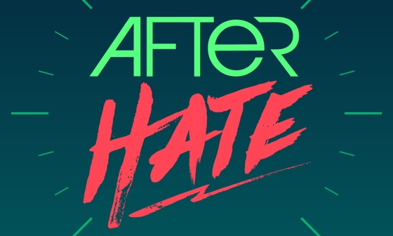

__Le pitch__ Le podcast qui déconstruit la pop culture, présenté par [kwyxz](https://twitter.com/Kwyxz) et [Kamuirobotics](https://twitter.com/Kamuirobotics). Bon ben tout est dit dans la présentation, deux copains qui parlent d'un sujet actuel de pop culture. Sujets variés, bien expliqués, parfois de la mauvaise foi mais avec justesse. Également, à la fin du podcast, toujours une petite recommandation d'un truc à lire, écouter ou voir.

__Mes kinks__ Quand kwyxz n'aime pas quand on lui coupe la parole, les intros de Kamuirobotics pour présenter kwyxz.

[Lien iTunes](https://itunes.apple.com/fr/podcast/after-hate/id1094216861)

## Banquette

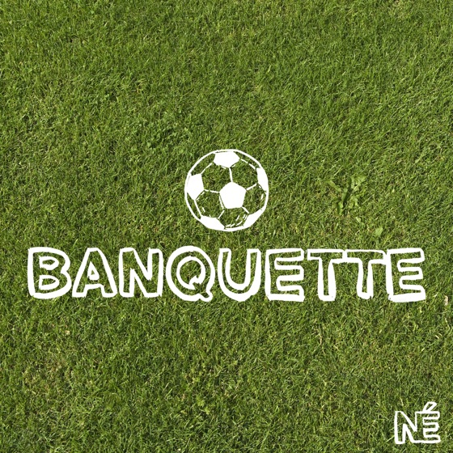

__Le pitch__ [Abdallah Soidri](https://twitter.com/AbdallahSoidri), journaliste sportif, interroge différents acteurs du football. Toujours des gens tout à fait intéressants qui ont des choses intéressantes et originales à dire. N'étant pas fan hardcore de football mais aimant quand même son univers, j'aime beaucoup les écouter.

__Mon kink__ La culture foot d'Abdallah.

[Lien iTunes](https://itunes.apple.com/fr/podcast/banquette/id1172772919)

## Bouffons

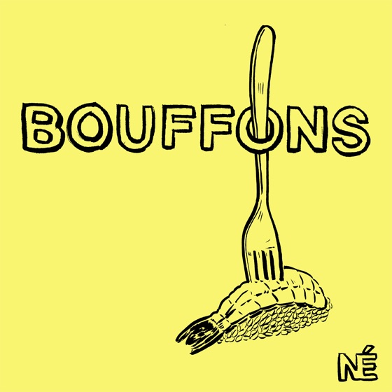

__Le pitch__ [Guilhem Malissen](https://twitter.com/GuilhemMalissen) nous parle de bouffe. Tout simplement. Ramen, bouffe de cantine, couscous, bouillons : un point de gastronomie présenté, avec des invités passionnés par leur métier.

__Mon kink__ G f1.

[Lien iTunes](https://itunes.apple.com/fr/podcast/bouffons/id1324604234)

## COMMUNITY MANAGER

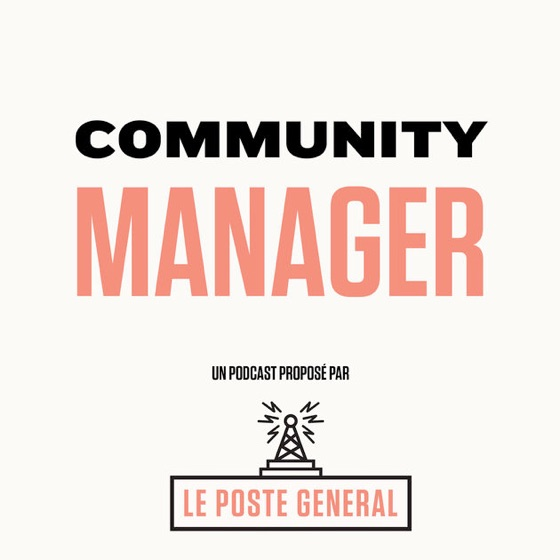

__Le pitch__ C'est [Guillaume Natas](https://twitter.com/natas) qui nous emmène dans les communautés sombres d'Internet.

__Mon kink__ Jamais aucun jugement de valeur sur les communautés présentées, toujours intéressant et documenté, très instructif.

[Lien iTunes](https://itunes.apple.com/fr/podcast/community-manager/id1380074584)

## Culture 2000

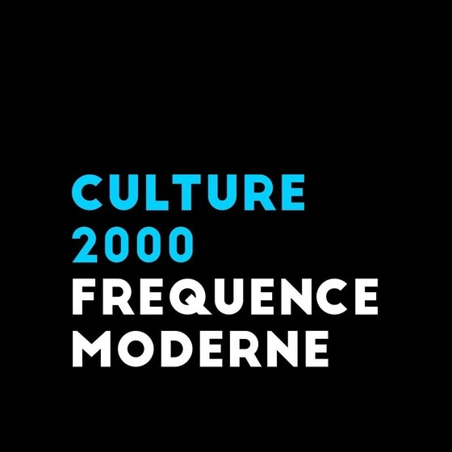

__Le pitch__ Même écurie que *2 Heures de Perdues*, ce sont plusieurs personnes qui se réunissent pour parler d'un point historique, géographique ou politique. Jamais barbant, toujours bien expliqué même des sujets parfois compliqués, bref, très accessible.

__Mon kink__ Ne pas me sentir plus con qu'un autre en les écoutant.

[Lien iTunes](https://itunes.apple.com/us/podcast/culture-2000/id1121043330)

## Epatant Podcast Omnisport

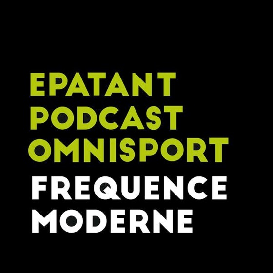

__Le pitch__ Même écurie que *2 Heures de Perdues*, ce sont plusieurs personnes qui se réunissent pour parler d'un point sport précis. Que ce soit Moto GP, Sport et guerre froide ou encore Imola 1994, ils reviennent sur les moments marquants du sport.

__Mon kink__ J'ai toujours entendu parlé de ces faits sportifs sans m'y renseigner plus que ça. Du coup même si je ne connais rien au sport présenté, c'est tellement bien expliqué qu'on s'y retrouve qu'importe le sujet abordé !

[Lien iTunes](https://itunes.apple.com/fr/podcast/e-p-o/id1352388007)

## FloodCast

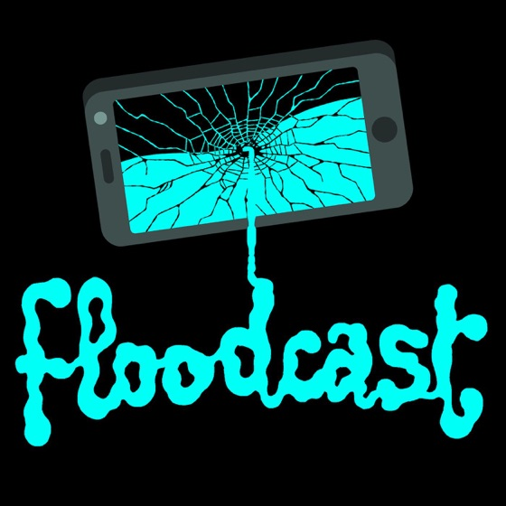

__Le pitch__ Podcast créé et dirigé par [@FloBer](https://twitter.com/mrflober), il y invite diverses personnes, principalement du Golden Moustache. C'est extrèmement drôle, c'est de l'humour parfois débile, parfois noir, je pense que je les écouterai une seconde fois d'ici peu. Un sujet choisi par FloBer et ils foncent tous dedans et en racontent de sacrées belles saloperies.

__Mon kink__ Avoir pleuré de rire comme un teubé tout seul dans la rue en les écoutant.

[Lien iTunes](https://itunes.apple.com/fr/podcast/floodcast/id1019768302)

## Histoires de Darons

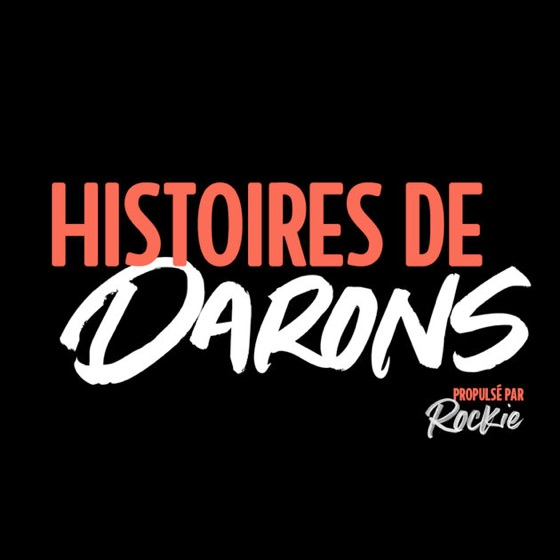

__Le pitch__ [Fabrice Florent](https://twitter.com/fabflorent) invite des darons à son micro pour nous parler de leur expérience. Très intéressant et surtout très utile si on est dans le sujet.

__Mon kink__ Rah, oh, hé, vous comprendrez quand vous aurez des gamins hin.

[Lien iTunes](https://itunes.apple.com/fr/podcast/histoires-de-darons/id1281339122)

## La Poudre

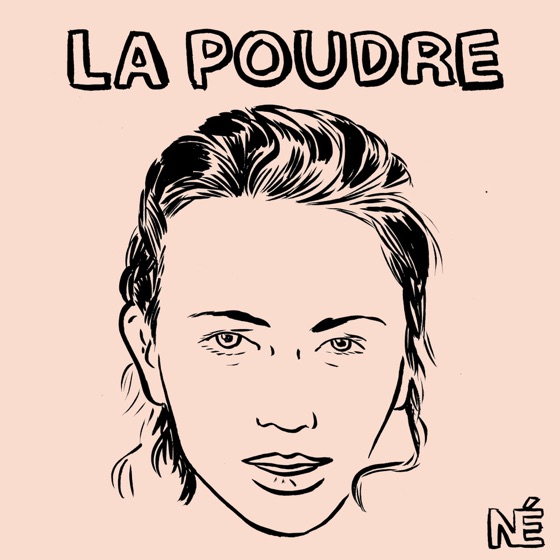

__Le pitch__ "[Lauren Bastide](https://www.instagram.com/laurenbastide/) reçoit dans une chambre d’hôtel une femme inspirante, artiste, activiste, politique pour une conversation intime et profonde." — [Pas mieux](https://www.nouvellesecoutes.fr/la-poudre/).

__Mon kink__ Ouverture sur le féminisme, son histoire, incroyablement intéressant.

[Lien iTunes](https://itunes.apple.com/fr/podcast/la-poudre/id1172772210)

## Les baladeurs

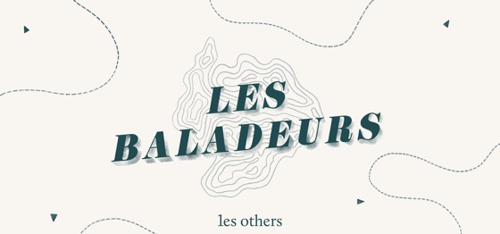

__Le pitch__ Podcast créé par le site [Les Others](https://www.lesothers.com/les-baladeurs-podcast-aventure/), Les Baladeurs nous présente différents explorateurs qui partent là où il n'y a rien.

__Mon kink__ Très bonne production, seule la voix de l'interviewé•e est présente. La personne raconte son aventure, nous emmène avec elle, on voyage, c'est incroyable.

[Lien iTunes](https://itunes.apple.com/fr/podcast/les-baladeurs/id1388330691)

## Lumières dans la nuit

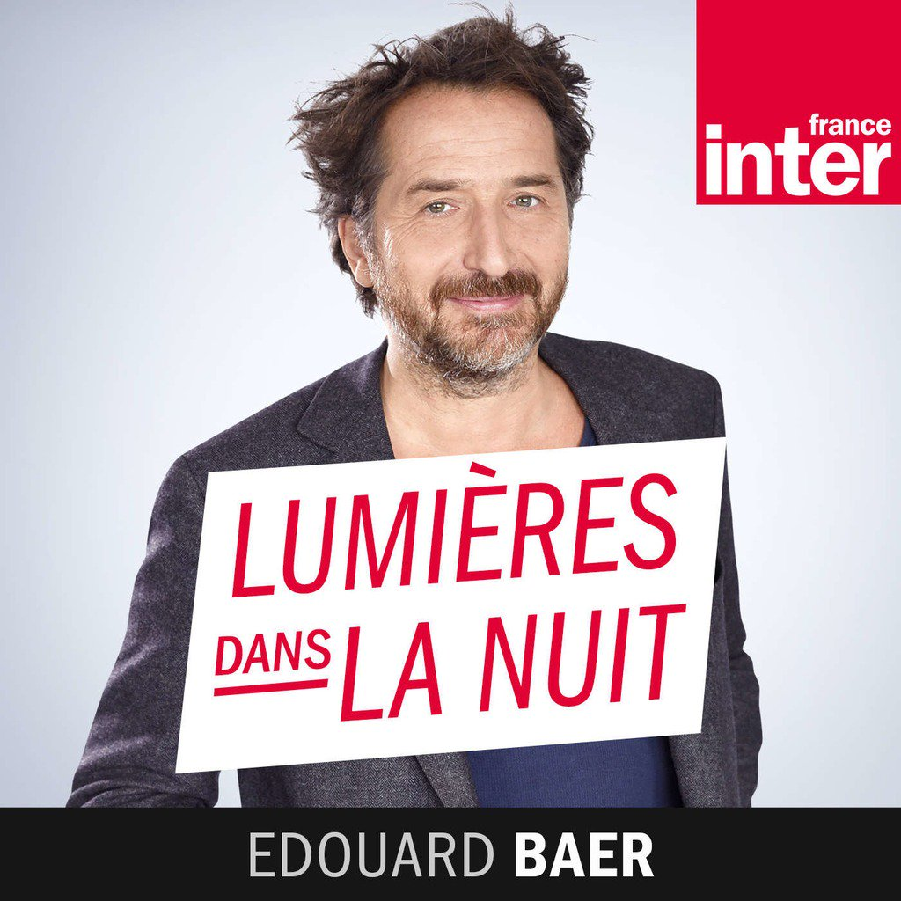

__Le pitch__ Pas un podcast mais un replay d'émission, Lumières dans la nuit est une émission censé aidé à nous faire passer le blues du dimanche soir.

__Mon kink__ Je ne connaissais pas plus que ça Édouard Baer.

[Lien iTunes](https://itunes.apple.com/fr/podcast/lumi%C3%A8res-dans-la-nuit/id1434734500)

## Putain de Code !

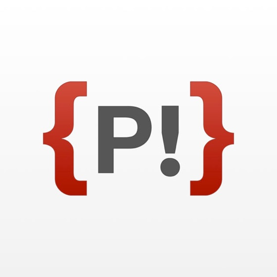

__Le pitch__ Les tauliers de [Putain de Code](http://putaindecode.io/) ([bloodyown](https://twitter.com/bloodyowl), [skinnyfoetusboy](https://twitter.com/skinnyfoetusboy), [Zoontek](https://twitter.com/zoontek), [MoOx](https://twitter.com/moox)) parlent de développement front-end. Podcast encore très jeune car 3 épisodes seulement, assez technique mais accessible, ils savent de quoi ils parlent et c'est chouette.

__Mon kink__ Heu j'en ai pas spécialement d'autant que je connais très bien Zoontek alors si je commence à dire des truc sur lui enfin bref non ça ira merci.

[Lien iTunes](https://itunes.apple.com/fr/podcast/putain-de-code/id1185311825)

## Riviera Détente

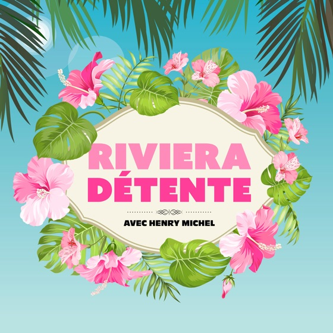

__Le pitch__ Présenté par [Henry Michel](https://twitter.com/henrymichel) et généralement [Patrick Patrick](https://twitter.com/bienfrag) (même s'il y a d'autre participants), bon, pas de pitch défini, ils choisissent un sujet au hasard et font des sortes de sketch dessus. Sauf qu'ils sont fin bourrés du coup c'est toi avec tes potes en fin de soirée. C'est assez drôle.

__Mes kinks__ Le rire d'Henry, la [playlist Spotify](https://open.spotify.com/user/henrymichel/playlist/5sOJ8OslI9Nn4A2umjKZiw) de l'émission.

[Lien iTunes](https://itunes.apple.com/fr/podcast/riviera-detente/id1062842476)

## Studio 404

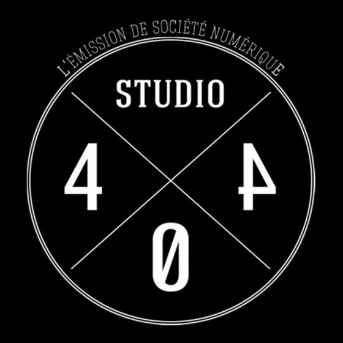

__Le pitch__ Présenté par [Lâm Hua](https://twitter.com/LamHua/) accompagné de [Daz](twitter.com/dazjam), [Misspress](https://twitter.com/misspress?lang=fr), [FibreTigre](https://twitter.com/fibretigre), [Sylvain Paley](https://twitter.com/sylvainpaley). Un sujet du monde numérique par chroniqueur (qui ont parfois un rapport, parfois non), ensuite il y a débat entre eux. Des personnalités très différentes qui n'hésitent pas à monter au clash, des sujets très actuels mais jamais pompeux, bref, très intéressant.

__Mes kinks__ La voix de Lâm bon ben voilà c'est dit, les trolls de Daz, quand Fibre part très loin.

[Lien iTunes](https://itunes.apple.com/fr/podcast/studio404/id574827178)

## Super Ciné Battle

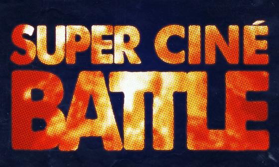

__Le pitch__ [Kamuirobotics](https://twitter.com/Kamuirobotics) et [GKPlugInBaby](https://twitter.com/GKPlugInBaby) font un classement de films (soumis par les auditeurs) par décennies. L'occasion de livrer des anecdotes sur le film et leurs impressions. Même quand ce sont des films que je ne connais pas, j'aime bien les écouter quand même.

__Mes kinks__ Regarder un film grâce à eux, leur culture cinématographique.

[Lien iTunes](https://itunes.apple.com/fr/podcast/super-cine-battle/id1113826981)

## Tire Bouchon

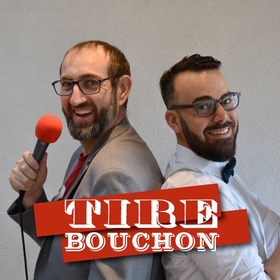

__Le pitch__ "Nous parlons des vins des côtes du Rhône et partons à la rencontre des vignerons pour connaitre le travail de la vigne et du vin." — [Leur bio Twitter](https://twitter.com/tirebouchon_pod). J'ai pas mieux comme présentation.

__Mes kinks__ Ça parle de pif et le pif je commence à bien aimer grâce à eux.

[Lien iTunes](https://itunes.apple.com/fr/podcast/tire-bouchon/id1331421582)

## Vertical Urban : rap et street culture

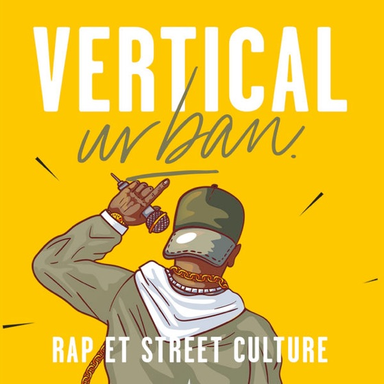

__Le pitch__ [Mrik](https://twitter.com/Mrik) nous présente en moins de 5 minutes les différentes actus du rap, tant FR que US.

__Mes kinks__ Clair, net, concis, intéressant.

[Lien iTunes](https://itunes.apple.com/us/podcast/vertical-urban-rap-et-street-culture/id1437417844)

## YESSS

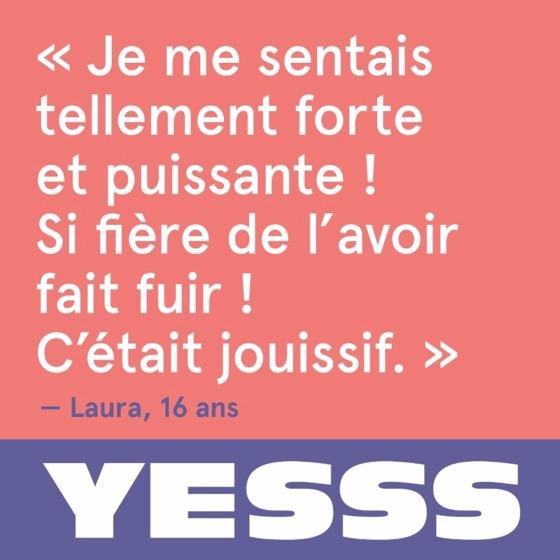

__Le pitch__ "YESSS est un podcast féministe et résolument positif : on célèbre les victoires de femmes contre le sexisme, les warriors du quotidien." — [Pas mieux](http://yessspodcast.fr/).

__Mes kinks__ Je me sens parfois très con à entendre tout ça.

[Lien iTunes](https://itunes.apple.com/fr/podcast/yesss/id1438764662)
