

    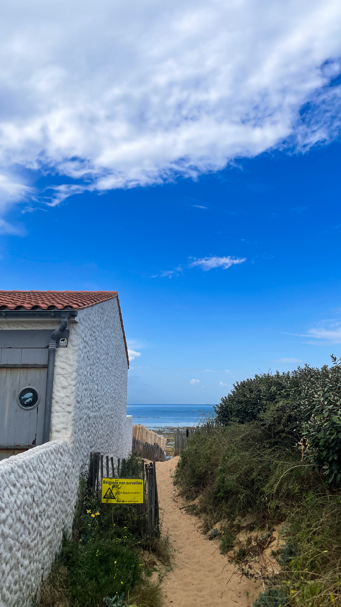
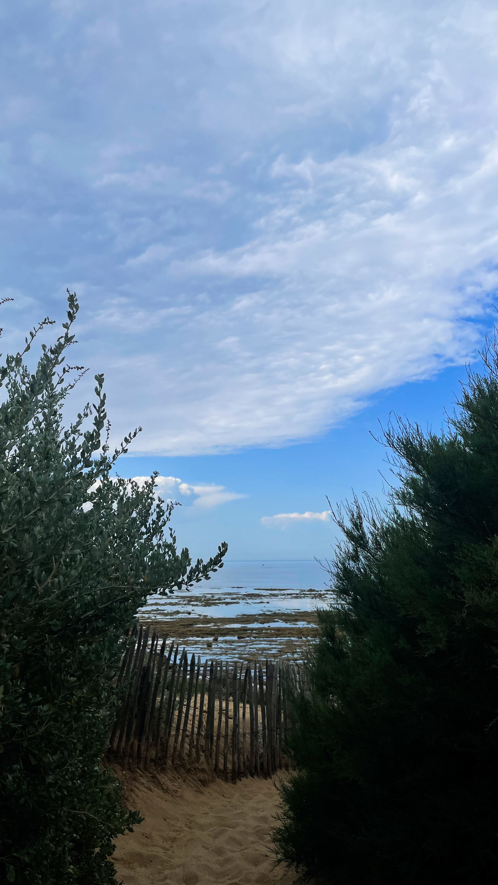

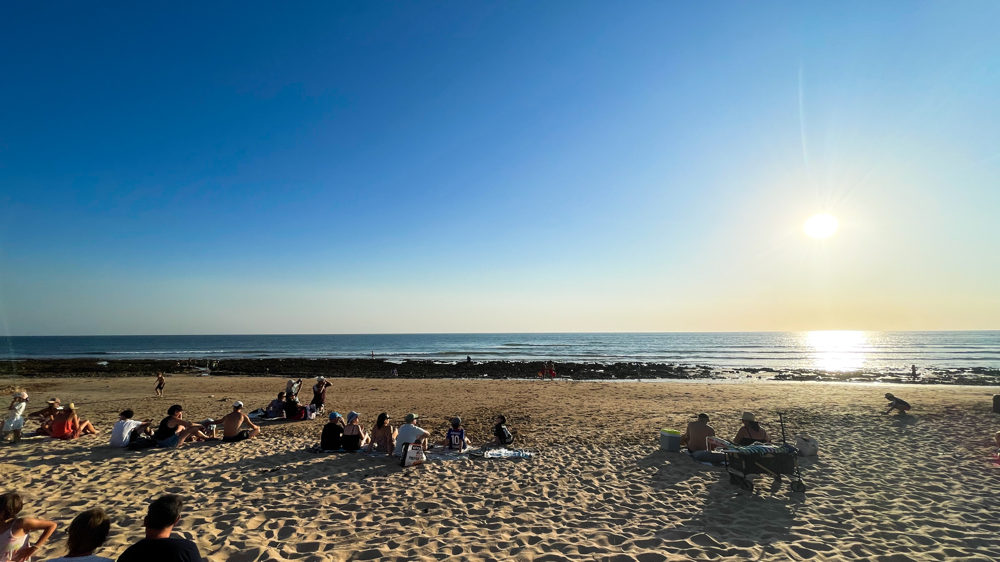

    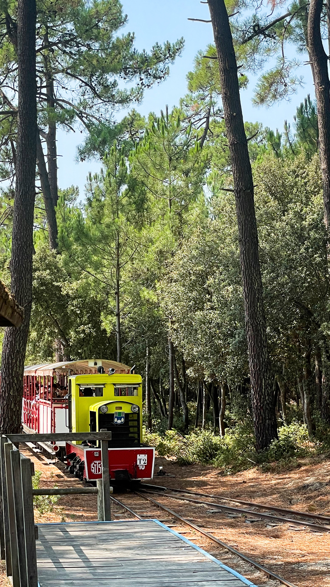
    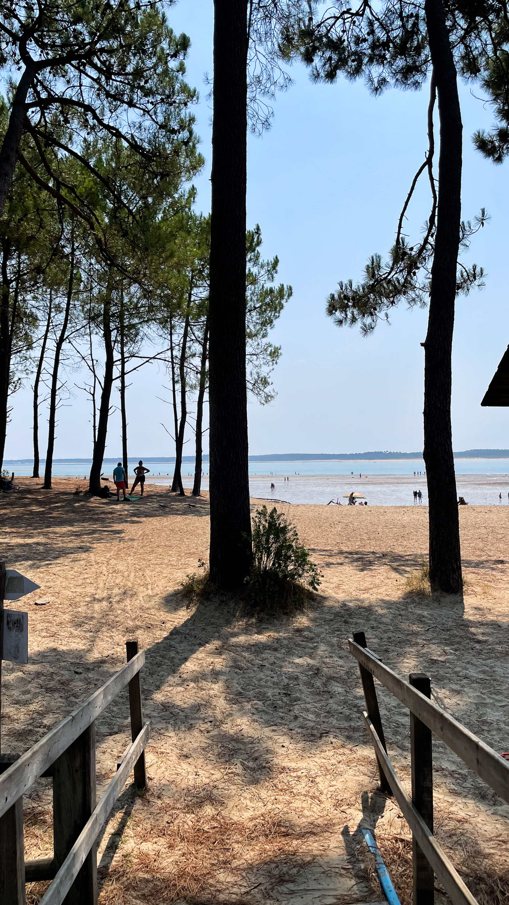

    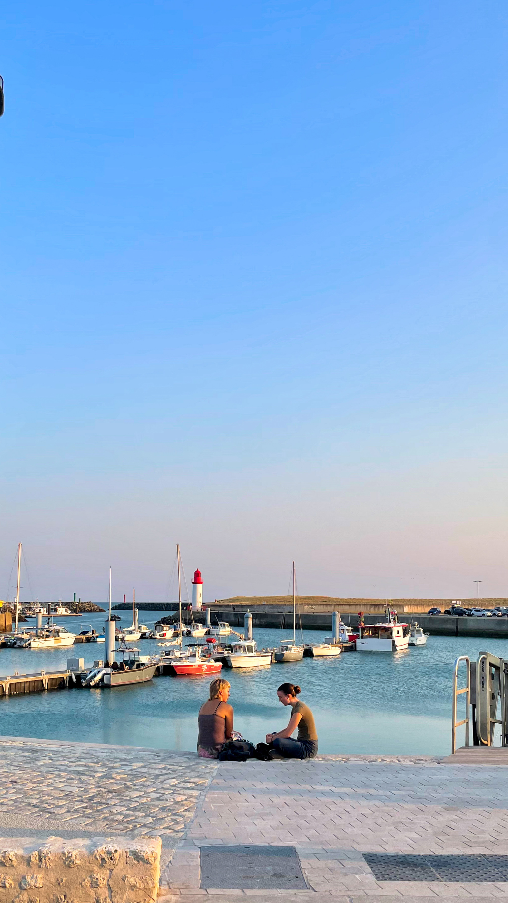
    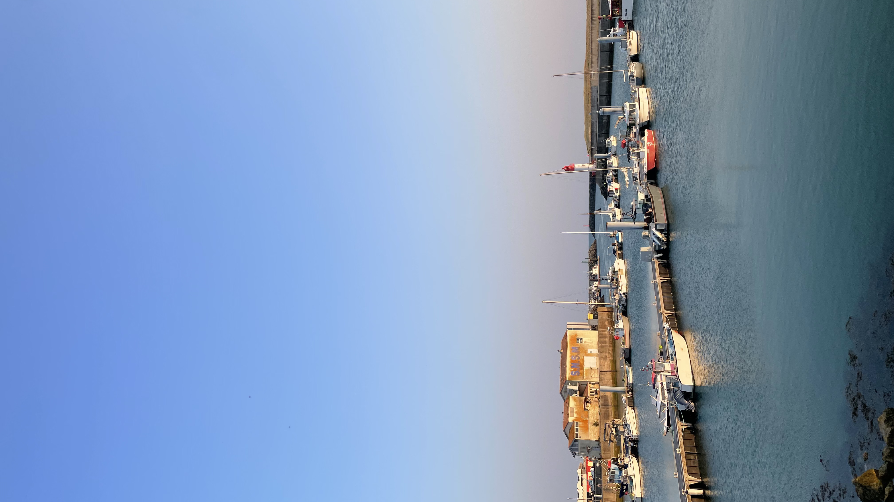

    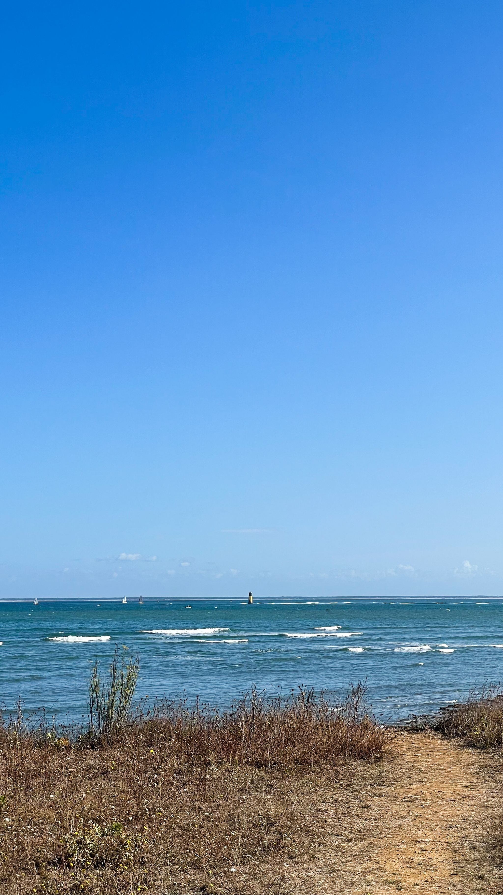
    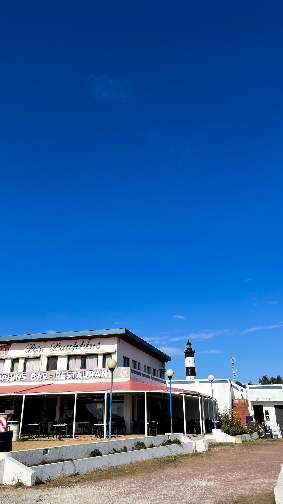

    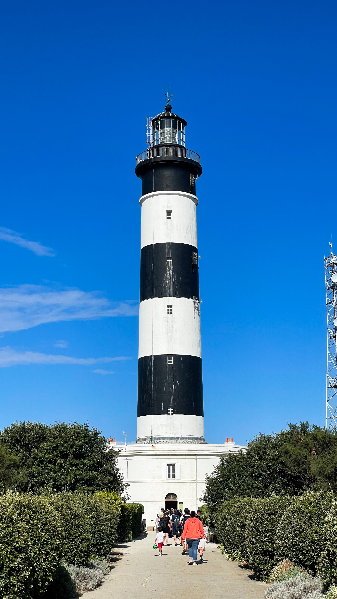
    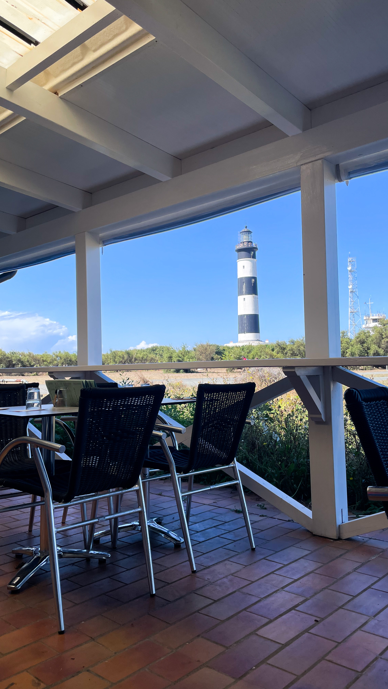

Globalement, je ne suis pas trop à l‘aise à raconter les histoires de mes photos.

C‘est qu‘il n‘y en a pas tant à raconter non plus. Je pourrai leur ajouter du contexte mais plusieurs contradictions en moi me disent que ça n‘intéresse pas grand monde, en même temps ce blog me sert principalement de souvenirs donc c‘est très personnel, néanmoins un peu de contexte ne ferait pas de mal, mais après tout pour qui je me prends pour espérer que ça puisse ne serait-ce qu‘intéresser une seule personne, mais la voix qui me souffle que cette histoire-ci, peut-être que vaut le coup d‘être racontée a été plus forte que les autres donc…

Donc, pour la petite histoire, nous étions derrière le phare de Chassiron à nous promener et prendre des photos de cette superbe vue, une aussi belle vue que la pointe d‘une île peut nous l‘offrir, et vas-y que ça fait croire aux gamins que ce qu‘on voit c‘est New York, et vas-y que ça demande à d‘autres parents de nous prendre en photos parce qu‘on est plus beaux qu‘eux, bref de parfaits petits touristes n‘est-ce pas.

Et là, cet homme au bob gris vient nous voir pour nous dire, attention le flex est immense, en même temps vu la suite il a le droit, et donc il nous dit "mon fils va passer dans une vingtaine de minutes en avion au dessus de nos têtes, il va arriver par le nord", on lui dit que trop bien, félicitations au fils, à la famille, on a hâte de le voir passer, on allait partir mais on va finalement rester.

On va s‘assoir à un endroit plus confortable pour attendre et là, au loin, trois tâches qui se déplacent à l‘horizon lointain. Vachement linéaire, gros et rapides pour des oiseaux.

Les neurones connectants, je suis allé me mettre derrière papa bob gris le prendre en vidéo et en photos puis je lui ai envoyé sur l‘instant via AirDrop, ça nous fera un souvenir à tous les deux.

    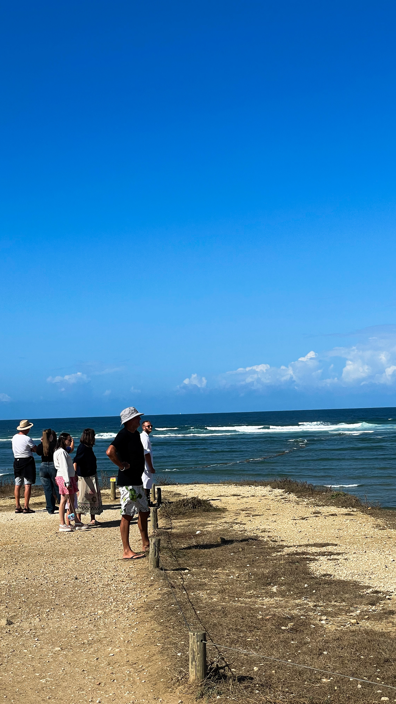
    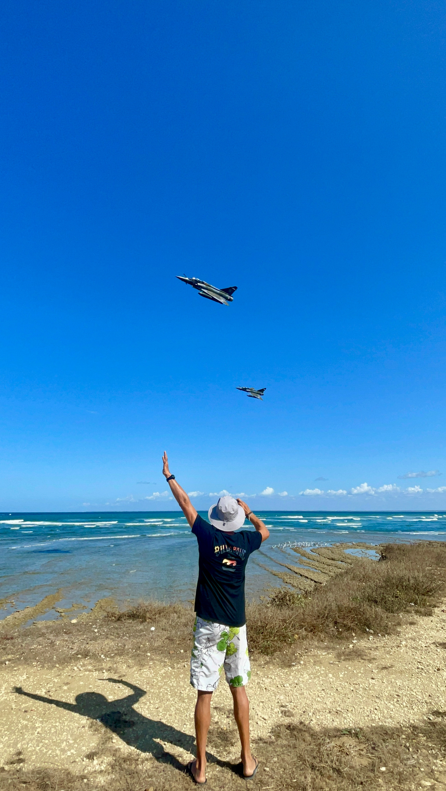

Les photos sont immondes car j‘ai oublié mon Fujifilm à la maison. ☠️
